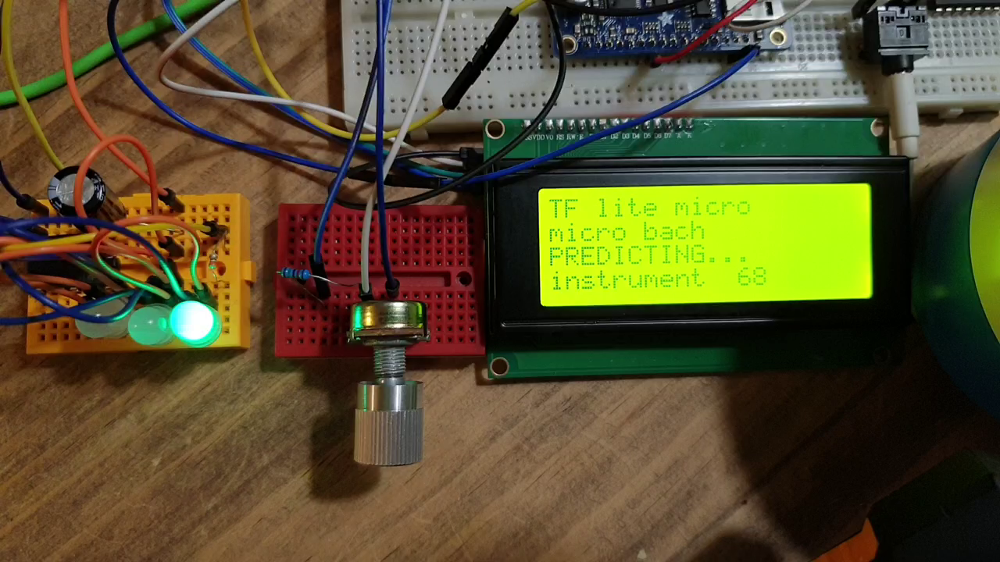
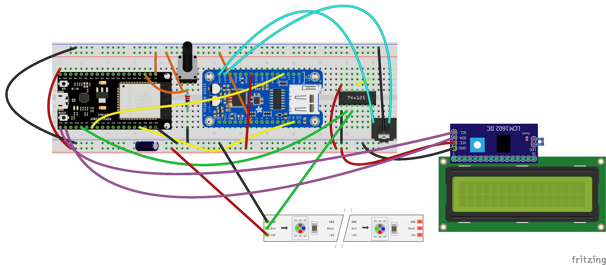

# micro_bach
Generates and play BACH music with Tensorflow Lite for microcontroler.

****Hardware configuration:

- ESP32 dev kit (4MB flash)
- Adafruit VS1053 MIDI breakout , used as MIDI synth (https://learn.adafruit.com/adafruit-vs1053-mp3-aac-ogg-midi-wav-play-and-record-codec-tutorial). This board can drive headset or powered speakers. One can also add a small amp (GF1002) and two 3W, 4 Ohm speakers (https://www.amazon.com/CQRobot-JST-PH2-0-Interface-Electronic-Projects/dp/B0738NLFTG)
- Some neopixel led. Will blink when playing notes (https://www.adafruit.com/product/1734)
- 3.3 to 5V level shitfter, to drive neopixels (https://www.adafruit.com/product/1787)
- I2C LCD display (https://eu.mouser.com/ProductDetail/Newhaven-Display/NHD-0416BZ-FL-GBW?qs=3vk7fz9CmNzcJfNAixTouw%3D%3D)
- Potentiometer, connected to one of the ESP32 ADC pin; will modify, in real time, the instrument used to play notes. The current instrument is displayed on the LCD.

The microcontroler applications extends another project: https://github.com/pabou38/play_bach. This play_bach repo contains the 'larger' python application, including training (locally on desktop or colab), tensorflow lite model generation (all quantization options, edge TPU, metadata), C file generation for microcontroler (model, corpus, dictionaries), as well as static MIDI file generation, and real time music streaming to any smartphone or tablet (browser based GUI).

Developped with VScode and PlatformIO.

The src directory contains main.cpp, the TFlite micro model, and corpus/dictionaries.

A breadbord schematic (Fritzing) is also available in this repo.

Please see also 
https://medium.com/nerd-for-tech/play-bach-let-a-neural-network-play-for-you-part-1-596e54b1c912 for more context for this work. it is a serie of Medium post.

